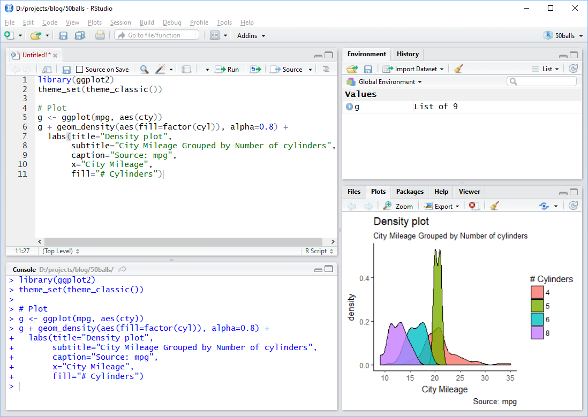

##  {#title-slide background="images/horn.JPG"}

```{r setup, include = FALSE}
library(tidyverse)

rotating_text <- function(x, align = "top") {
  glue::glue('
<div style="overflow: hidden; height: 1.2em;">
<ul class="content__container__list {align}" style="text-align: {align}">
<li class="content__item">{x[1]}</li>
<li class="content__item">{x[2]}</li>
<li class="content__item">{x[3]}</li>
<li class="content__item">{x[4]}</li>
</ul>
</div>')
}

fa_list <- function(x, incremental = FALSE) {
  icons <- names(x)
  fragment <- ifelse(incremental, "fragment", "")
  items <- glue::glue('<li class="{fragment}"><span class="fa-li"><i class="{icons}"></i></span> {x}</li>')
  paste('<ul class="fa-ul">', 
        paste(items, collapse = "\n"),
        "</ul>", sep = "\n")
}

```

::: title-box
<h2>`r rmarkdown::metadata$pagetitle`</h2>

👨‍💻 [`r rmarkdown::metadata$author` \@ `r rmarkdown::metadata$institute`]{.author} 👨‍💻

`r rotating_text(c('<i class="fa-solid fa-envelope"></i> eugene.hickey@tudublin.ie', '<i class="fa-brands fa-mastodon"></i> @eugene100hickey', '<i class="fa-brands fa-github"></i> github.com/eugene100hickey', '<i class="fa-solid fa-globe"></i> www.fizzics.ie'))`
:::

------------------------------------------------------------------------

## Week One

-   Welcome to the course on statistical computing.

-   We will discuss how to make the most of your data.

-   Complimentary to the qualitative analysis you do with Emma.

-   Goal here is to provides skills in data analysis.

-   We'll learn to use a software system called ***R***.

# Acknowledgments

::::: columns
::: {.column width="40%"}
{.absolute right="85%" width="200"} {.absolute right="65%" bottom="10%" width="200"} {.absolute right="65%" width="200"}
:::

::: {.column width="60%"}
-   [Ruth Moran](https://www.itsligo.ie/research/research-office/){target="_blank"}, co-pilot for this workshop Graduate Research & Education Training Officer.

-   slides produced using [quarto](https://quarto.org/){target="_blank"}

-   assessments produced using [Rexams](https://www.r-exams.org/){target="_blank"}
:::
:::::

# Target Audience

-   Graduate students looking for better ways to present their data.

-   People currently using tools like MS Excel for analysis.

# Why R?

-   Working with a mouse isn't reproducible

    -   difficult to log exactly what you've done
    -   hard to repeat for a series of analyses
    -   difficult to be inspired by other people's work

-   Good to separate sources of data from the analysis

-   R uses series of commands that input, manipulate, and display data

-   Lots of contributors around the globe, diverse fields

    -   this is the world of open source software

# Course Outline

1)  Introduction to Statistical Computing & R - *Saturday April11th*

2)  Statistical Inference - *Saturday April 18th*

3)  Manipulating Data - *Saturday April 25th*

4)  Getting and Cleaning Data - *Saturday May ??*

5)  Data Visualisation - *Saturday May ??*

## Stuff we won't be doing

1.  creating functions, iterating

2.  R is cracker at machine learning

3.  also great at making documents and presentations using [quarto](https://quarto.org/){target="_blank"}

4.  and websites and blogs

## Assessment

::::: columns
::: {.column width="60%"}
-   [Weekly online quizzes]{style="color: darkred; font-weight: bold;"}
    -   get three attempts
    -   best mark from the three
    -   some multiple choice, some open answer
    -   based on this weeks lecture
-   [Exercises to be done within R]{style="color: darkred; font-weight: bold;"}
    -   these are called `swirl()`
    -   email results to me (screenshot of final page is fine)
:::

::: {.column width="40%"}
-   [Project at end of course]{style="color: darkred; font-weight: bold;"}
    -   somewhat optional, can either do one on Emma's section or on this part, or a combination
    -   best to do something associated with your research that can be useful beyond this module
:::
:::::

# Resources

-   [Big Book of R](https://www.bigbookofr.com/index.html){target="_blank"}

# Books

-   *recommended text*
-   [Hadley's book, R for Data Science](https://r4ds.had.co.nz/){target="_blank"}
-   [The Epidemiologist R Handbook](https://www.epirhandbook.com/en/index.html){target="_blank"}
-   [Data Science in Education Using R](https://datascienceineducation.com/){target="_blank"}
-   [Fundamentals of Data Visualization by Wilke](https://clauswilke.com/dataviz/){target="_blank"}, lots of his actual code is on github at [https://github.com/clauswilke/practical_ggplot2](https://github.com/clauswilke/practical_ggplot2){target="_blank"}
-   Data Visualization by Kieran Healy (ISBN = 978-0691181622). \~€25. Also online at [https://socviz.co/index.html](https://socviz.co/index.html){target="_blank"}
-   check out the list of online books at [bookdown.org](https://bookdown.org/){target="_blank"}

{.absolute bottom="10" right="10" width="100"}

# Websites

-   Karl Broman (https://www.biostat.wisc.edu/\~kbroman/), and particularly [this presentation](https://www.biostat.wisc.edu/~kbroman/presentations/graphs_MDPhD2014.pdf){target="_blank"}

-   course by Boemhke on github [github.com/uc-r/Intro-R](https://github.com/uc-r/Intro-R){target="_blank"}

-   the good people at RStudio have lots of help at [https://posit.co/](https://posit.co/){target="_blank"}

-   [Cedric](https://www.cedricscherer.com/2019/08/05/a-ggplot2-tutorial-for-beautiful-plotting-in-r/){target="_blank"}.

-   [The R Graph Gallery](https://www.r-graph-gallery.com/index.html){target="_blank"} is pretty good and worth checking out

{.absolute bottom="10" right="10" width="100"}

# Blogs and Podcasts

-   [www.simplystatistics.org](https://simplystatistics.org/){target="_blank"}

-   [varianceexplained.org](http://varianceexplained.org/){target="_blank"}

-   [Not So Standard Deviations](http://nssdeviations.com/){target="_blank"}

-   [Thomas Lin Pedersen video](https://github.com/thomasp85/ggplot2_workshop){target="_blank"}

-   [David Robinson's screencasts](https://www.youtube.com/@safe4democracy/streams){target="_blank"}

{.absolute bottom="10" right="10" width="100"}

# Online Courses

-   Coursera: [Data Science from Johns Hopkins](https://www.coursera.org/specializations/jhu-data-science){target="_blank"}. The course notes are on [github](http://datasciencespecialization.github.io/){target="_blank"}

-   edx.org [course from Irizarry](https://www.edx.org/course/data-science-visualization){target="_blank"}

{.absolute bottom="10" right="10" width="100"}

# Miscellaneous

-   [R Ladies+](https://rladies.org/){target="_blank"}

-   [RWeekly.org](https://rweekly.org/){target="_blank"}, round up of events in the world of R

-   [#Rstats on](https://mastodon.social/tags/rstats){target="_blank"} [twitter]{style="text-decoration:line-through;"} [Mastodon](https://mastodon.social/tags/rstats)

-   [#TidyTuesday](https://twitter.com/search?q=%23TidyTuesday&src=typeahead_click){target="_blank"} on twitter

-   [R Cheatsheets](https://rstudio.com/resources/cheatsheets/){target="_blank"}

-   if you get stuck, google is your friend. Often sends you to stackoverflow.com or stackexchange.com

# Installing R and RStudio

-   first R from [CRAN](https://cran.r-project.org/){target="_blank"}

    -   **R** is the engine

-   then RStudio from [Posit](https://posit.co/download/rstudio-desktop/){target="_blank"}

    -   **RStudio** is the cockpit

-   alternative is to make an account at [Posit Cloud](https://posit.cloud/){target="_blank"}

    -   give 25 hours per month

-   R is case sensitive

-   [This](https://learnr-examples.shinyapps.io/ex-setup-r/#section-welcome){target="_blank"} is a nice tutorial suite to explain installing R and RStudio:

## RStudio Screen

{.absolute top="50" right="10" width="70%"}

## Using RStudio

-   toolbar across the top
    -   I don't use this very much
-   set of quick links below that
    -   top left (green plus sign) is about the only one I use
-   4 Panes
    -   top left for files or looking at data
    -   bottom left for the console
    -   top right for *Environment* - tells what variables are stored
    -   bottom right for plots and help

## Using RStudio (continued)

-   usual work flow is:
    -   try commands out at the console (bottom left)
    -   when that works, store them in a file (top left)
    -   when sequence of commands works, put them into a document (also top left)

## Extending R

-   installing R just gives you *base* R
-   beauty of this tool lies with *packages* 📦
-   we'll look at installing these from three sources:
    -   CRAN
    -   Bioconductor
    -   github

## CRAN

-   [CRAN](https://cran.r-project.org/){target="_blank"}
    -   example, on console type `install.packages("palmerpenguins")`
    -   this installs the *palmerpenguins* package (we'll need this for this week's quiz)
    -   over 20k packages on CRAN (see list [here](https://cran.r-project.org/web/packages/available_packages_by_name.html){target="_blank"})
    -   sometimes esoteric ([engsoccerdata](https://github.com/jalapic/engsoccerdata){target="_blank"})
    -   sometimes cutting edge ([deep learning](https://tensorflow.rstudio.com/){target="_blank"})
    -   each package heavily curated and maintained
    -   [Task Views](https://cran.r-project.org/){target="_blank"} good place to start looking

## Bioconductor

-   [Bioconductor](https://www.bioconductor.org/){target="_blank"}
    -   set of bioinformatics packages (lots of genomics)
    -   start with `install.packages("BiocManager")`
    -   then `BiocManager::install("some_genomics_package")` to use
    -   list of packages [here](http://bioconductor.org/packages/release/BiocViews.html){target="_blank"}
    -   about 3,000 packages, including genome builds

## Github

-   github
    -   packages in development
    -   start with `install.packages("devtools")`
    -   then `devtools::install_github("developer_name/package_name")`
    -   almost 80k packages [here](https://github.com/qinwf/awesome-R){target="_blank"}
    -   the package [githubinstall](https://github.com/hoxo-m/githubinstall){target="_blank"} is useful to search these

## Installing Packages

-   try `install.packages("scales")`
    -   will add functions from someone else's work so you can use it
    -   need to do this just once
    -   to actually make this available, type `library(scales)`
    -   do this every time you start R and want to use *scales* package
-   one package we'll need is *tidyverse*, `install.packages("tidyverse")`
    -   this might take a few minutes because such a large collection of packages

------------------------------------------------------------------------

1.  Using the Console
2.  Storing Values
3.  Fundamental Data Types
4.  The Dataframe - Rows $\times$ Columns
5.  Dataframe Columns
6.  Subsets of Dataframes
7.  Small Useful Functions

## Using the Console

-   R is a calculator
-   can type, say, `45 + 17` and get the answer back
-   *\** is multiply, */* is divide
-   get constants like *pi* for $\pi$
-   can run functions from the console like, say, `sqrt(x=49)` (or just `sqrt(49)`)
-   can get help on these functions by typing, say, `?sqrt`
-   to get list of help in the base package try `base::` and then press *tab*

## Storing Values

-   results of calculations can be stored
-   do this with `my_square_root_result <- sqrt(49)`
-   the `<-` reads as *gets* (can also us equals sign, *=*, but that's sloppy)
-   keyboard short cut for *\<-* is *alt* and *-* simultaneously
-   full list of RStudio shortcuts in *Help* on the toolbar (ironically, of course, there is a keyboard shortcut for keyboard shortcuts help)
-   list of stored values given in the *Environment* tab of RStudio

## Fundamental Data Types

-   *numeric* (or *double*) is for numbers with decimals. Default for numbers.
-   *integer* for counting numbers. Type in `x <- 72L` to get integer 72
-   *logical* gives *TRUE* and *FALSE*
-   *character* gives text. Try typing `x <- "I am Groot"`.
    -   Equivalent is `x <- 'I am Groot'`
-   *complex* is for stuff like *14 + 3i*. I've never used these. Ironically `sqrt(-1)` gives an error rather than *i*
-   *factor*. These deserve fuller explanation and get a slide of their own.

------------------------------------------------------------------------

## Factors

-   super useful when only limited number of possible values for a variable
-   examples like *female* / *male* or *Alabama* / *Alaska* / .... *Wyoming*
-   possible values are called *levels*
-   levels have an order, default is alphabetical but can adjust this
-   *forcats* package in the tidyverse deals with factors
-   have big impact on figures
    -   figures will look different depending on whether a variable is a factor or a character
    -   legend will be in the order of levels of a factor

------------------------------------------------------------------------

-   can change between data types using the *as.* functions
    -   e.g. `as.character()`, `as.numeric()`
    -   check out all the function in *forcats* for dealing with factors
-   can figure out the data type using the `class()` function

------------------------------------------------------------------------

## Data Frames

-   these are the workhorse of R data types
-   look like spreadsheets
-   we'll work with them a lot
-   organised by *rows* (across) and *columns* (down)
-   each column must have the same type
-   can examine data frames using the `View()` function (note, capital "V")
-   can find column names using the `names()` function
-   related concepts are *tibbles* and *data.tables*

## Subsets of Data Frames

-   can access individual column elements by specifying the row and column position
    -   e.g. `mtcars[2, 5]` is the 2nd row of the fifth column
-   can access an entire row by leaving the column part blank
    -   e.g. `mtcars[2, ]` is the whole 2nd row
-   likewise get the entire column by leaving the row slot empty
    -   e.g. `mtcars[,5]` is the entire 5th column

## Subsets of Data Frames

-   can also access columns using the dollar sign, **\$**
    -   e.g. `mtcars$cyl` gives the 2nd column, called *cyl*\
    -   note `mtcars$cyl[2]` gives the second element of this
-   can use a number range using *:* to get a bunch of values
    -   e.g. `mtcars[1:4, 2:4]` takes a chunk of the mtcars data frame

------------------------------------------------------------------------

## Lists

-   dataframes have constraints

    -   all columns must be the same type

    -   rows and columns must be the same length

-   `lists` are more general

-   example, `list_data <- list(c("Jan","Feb","Mar"), matrix(c(3,9,5,1,-2,8), nrow = 2),    list("green",12.3))`

-   `list_data[[1]]` gives the three months, etc

    -   note the double square bracket,`[[ ]]`

## Some Useful Functions

-   `c()` let's you create a vector of quantities. Coerced to same type
-   `is.na()` to check if a missing value, `sum(is.na())` gives total of these
-   `dim()` gives number of rows / columns in data frame, also `length()`
-   `class()` for nature of variable
-   `summary()`, `str()`, `glimpse()` show data frame parameters. Also `skim()` from the *skimr* package
-   I use `%in%` quite a bit, checks if value is among a bunch of values
    -   `"August" %in% month.name`
    -   `"£" %in% letters`

------------------------------------------------------------------------

## Some Useful Functions

-   `Sys.date()`, `Sys.time()`
-   `ls()` gives list of variables
-   `file.list()` gives list of files
-   `sessionInfo()` tells you what packages are loaded
-   `citation()` tells you about a package
-   `mean()` calculates mean of a vector, `sd()` the standard deviation
-   `complete.cases()` returns `TRUE` if there are no missing values in a row

## And Some Weird Characters

-   get to use a lot of the keyboard in R
    -   we've seen `$` to extract a column of a data frame
    -   `()` are arguments to functions
    -   `[]` are gateways to data frame elements
    -   `%>%` is called the pipe and is really cool. *Ctrl + Shift + M* shortcut
    -   some logical operators: `!` is NOT, `|` (or `||`) is OR, `&` (or `&&`) is AND

# Workshop - Week One

## Perform the Following Tasks:

::: {style="font-size: 50%; list-style-position: outside; padding-left: 0em;"}
1.  multiply the numbers $25\times \pi$ and save the result to my_first_result

2.  make a vector of five numbers e.g. 34.1, 54.4, 71.5, 93.8, 22.6 and save them to my_second_result

3.  multiply my_second_result by 7 and print the results

4.  print the `airquality` dataset

5.  examine the `airquality` dataset using `summary()`, `str()`, and `glimpse()`. For the latter you'll need the *tidyverse* library.

6.  store the values of `Temp` from the `airquality` dataset in a new variable you can call `temperature`

7.  calculate the `mean()` of `temperature`

8.  calculate the standard deviation, `sd()`, of `temperature`

9.  find the names of the columns in the `Puromycin` dataset

10. look up the help for the `USJudgeRatings` dataset and find out what is meant by the "DECI" column name

11. install and load up the package *dslabs*. Use `is.na()` and `sum()` to find the number of missing values in the `us_contagious_diseases` dataset

12. what kind of variable is stored in `olive$area`?

13. what are the levels of the factor in `olive$region`?
:::

## Assignments - Week One

1.  Complete week one moodle quiz

2.  Complete `swirl()` exercises

::: {style="font-size: 80%; margin-left: 150px;"}
-   `install.packages("swirl")`

-   `library(swirl)`

-   `install_course("R Programming E")`

-   `swirl()`

-   choose course *R Programming: The basics of programming in R*

-   do the four exercises 1 (basic Building Blocks) to 4 (Vectors)

-   email the results to eugene.hickey\@associate.atu.ie

<!-- 1: Basic Building Blocks      2: Workspace and Files      -->

<!--  3: Sequences of Numbers       4: Vectors                  -->

<!--  5: Missing Values             6: Subsetting Vectors       -->

<!--  7: Matrices and Data Frames   8: Logic  -->
:::
