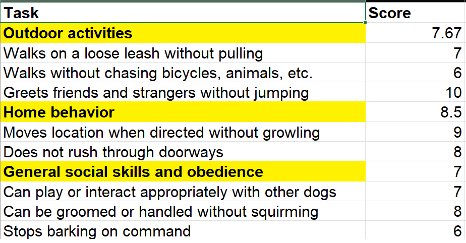
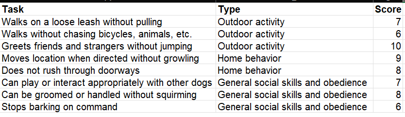
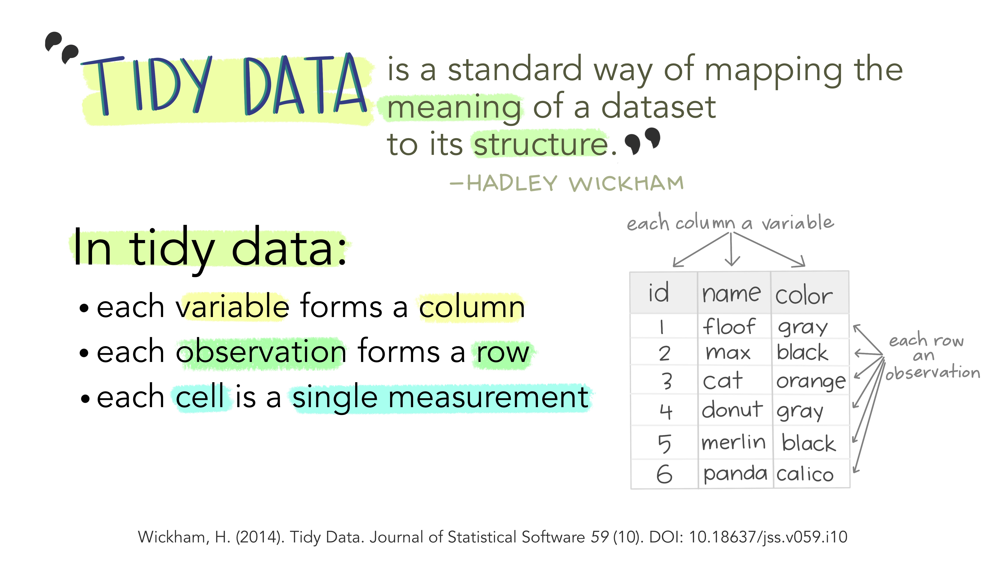
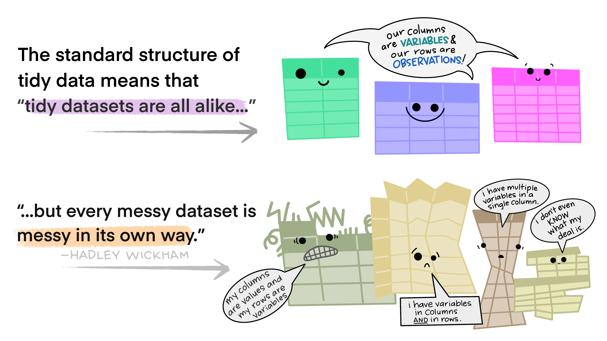
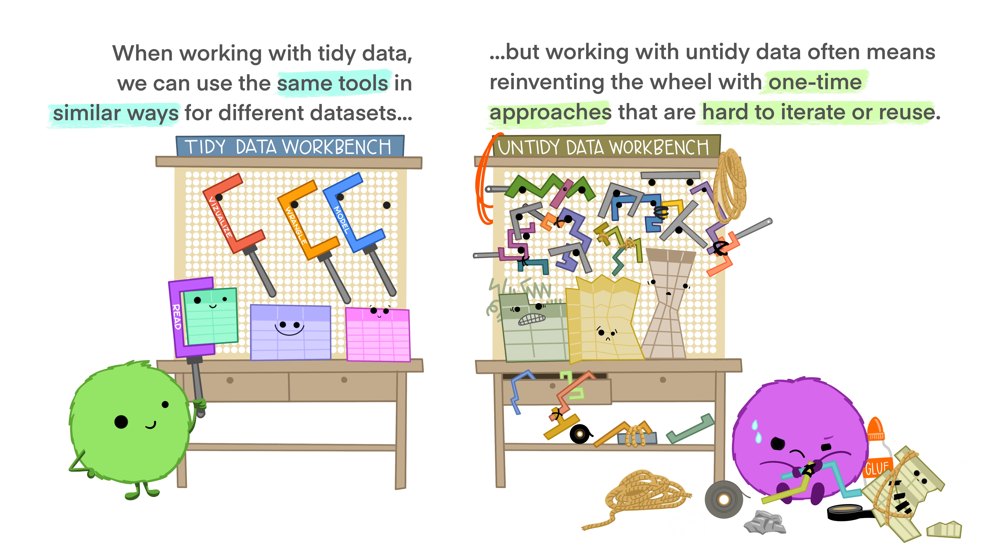
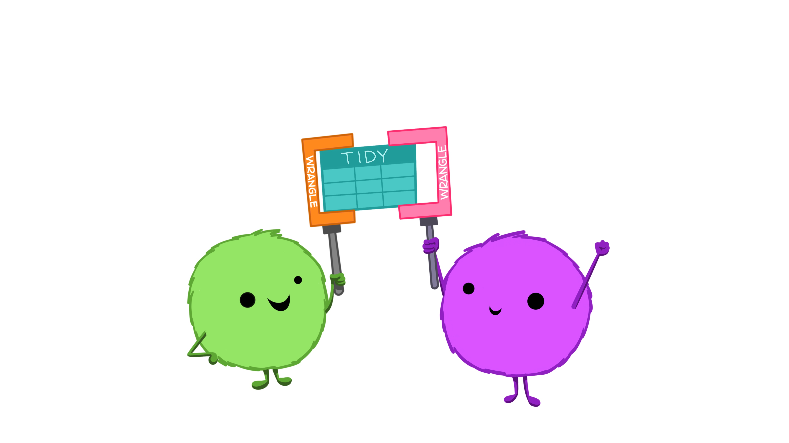
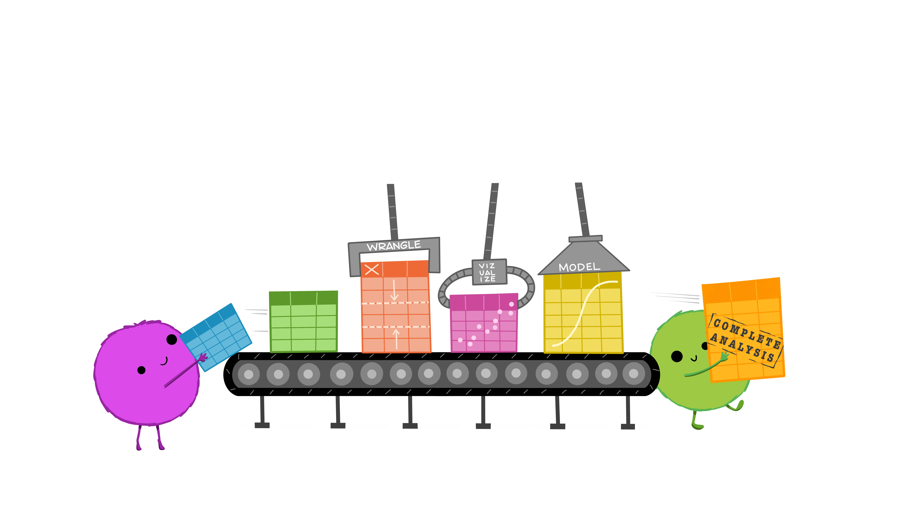
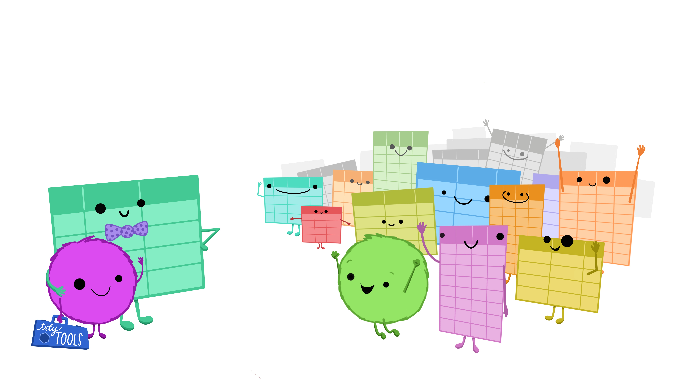
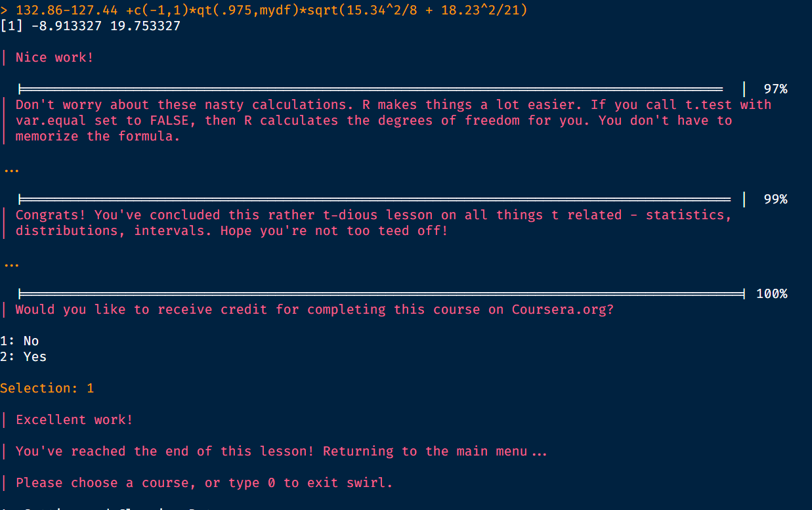

##  {#title-slide background="images/sunset.JPG"}

```{r setup, include = FALSE}
library(tidyverse)
library(palmerpenguins)
library(showtext)

rotating_text <- function(x, align = "top") {
  glue::glue('
<div style="overflow: hidden; height: 1.2em;">
<ul class="content__container__list {align}" style="text-align: {align}">
<li class="content__item">{x[1]}</li>
<li class="content__item">{x[2]}</li>
<li class="content__item">{x[3]}</li>
<li class="content__item">{x[4]}</li>
</ul>
</div>')
}

fa_list <- function(x, incremental = FALSE) {
  icons <- names(x)
  fragment <- ifelse(incremental, "fragment", "")
  items <- glue::glue('<li class="{fragment}"><span class="fa-li"><i class="{icons}"></i></span> {x}</li>')
  paste('<ul class="fa-ul">', 
        paste(items, collapse = "\n"),
        "</ul>", sep = "\n")
}

```

```{r ggplot-theme}
#| cache: true
#| echo: false

my_font <- "Neucha"
my_font <- "Coming Soon"
font_add_google(my_font, family = my_font)
showtext_auto()
theme_clean <- function() {
    theme_minimal(base_family = my_font) +
        theme(panel.grid.minor = element_blank(),
              text = element_text(size = 20, family = my_font),
              plot.background = element_rect(fill = "white", color = NA),
              axis.text = element_text(size = 20),
              axis.title = element_text(face = "bold", size = 28),
              strip.text = element_text(face = "bold", size = rel(0.8), hjust = 0),
              strip.background = element_rect(fill = "grey80", color = NA),
              legend.text = element_text(size = 28))
}
```

::: title-box
<h2>`r rmarkdown::metadata$pagetitle`</h2>

👨‍💻 [`r rmarkdown::metadata$author` \@ `r rmarkdown::metadata$institute`]{.author} 👨‍💻

`r rotating_text(c('<i class="fa-solid fa-envelope"></i> eugene.hickey@tudublin.ie', '<i class="fa-brands fa-mastodon"></i> @eugene100hickey', '<i class="fa-brands fa-github"></i> github.com/eugene100hickey', '<i class="fa-solid fa-globe"></i> www.fizzics.ie'))`
:::

------------------------------------------------------------------------

## Week Three - Manipulating Data

::: {style="font-size: 80%;"}
-   Once we get our data, we have to do stuff with it

-   Often means recasting the shape of our data

-   The `dplyr` library is a key player here

-   six verbs

    -   `filter()` chooses some of the rows

    -   `select()` chooses some of the columns

    -   `mutate()` makes new columns

    -   `arrange()` sorts the rows by some values

    -   `group_by()` puts rows together

    -   `summarise()` makes new rows based on `group_by()`
:::

## The Pipe - %\>%

-   neat feature, takes a bit of getting used to
-   but makes life way simpler and code more readable
-   chains operations together
-   read it in your head as *"and then..."*
-   alternatives are, well, ugly. And unforgiving.
-   also can look like this: `|>` or `| >`
-   keyboard shortcut `Ctrl` plus `SHFT` plus `m`

------------------------------------------------------------------------

## The Pipe - %\>% continued

-   we've used it extensively so far, and can go even further
-   basic idea is that you send the output from one line into the first (unnamed) argument of the next
-   keyboard shortcut, one worth knowing, is Ctrl + Shift + M
-   if you're really interested, other pipes such as the T-pipe (%T%) and the dollar pipe (%\$%)

------------------------------------------------------------------------

## filter

-   used to choose some rows from a dataframe
-   pass in the dataframe and some logical condition
    -   could be *==* (note the double equals), for characters and *\<*, *\>* for numerics
    -   also *\<=*, *\>=*, *!* (for NOT)
    -   can use *between()*
    -   I like *%in%*
-   can have multiple logical conditions in the same filter

```{r libraries, message=F, warning=F, echo=FALSE}
library(tidyverse)
library(gapminder)
library(knitr)
library(kableExtra)
library(dslabs)
```

------------------------------------------------------------------------

::::: columns
::: {.column width="50%"}
```{r filter_example}
# you'll need the libraries: tidyverse, gapminder, and knitr
gapminder::gapminder %>% 
  filter(continent == "Africa", 
         between(pop, 20e6, 50e6), 
         year %in% c(1952:1964)) %>% 
  gt::gt()
```
:::

::: {.column width="50%"}

:::
:::::

## select()

-   used to pick out columns from a dataframe
-   pass in the dataframe and one or more columns
    -   can *deselect* columns with a minus sign

------------------------------------------------------------------------

::::: columns
::: {.column width="50%"}
```{r select1_example}
gapminder::gapminder %>% 
  select(country, year, lifeExp) %>% 
  head() %>% 
  gt::gt()
```
:::

::: {.column width="50%"}
```{r select2_example}
gapminder::gapminder %>% 
  select(-c(continent, pop)) %>% 
  head() %>% gt::gt()
```
:::
:::::

------------------------------------------------------------------------

::::: columns
::: {.column width="50%"}
### mutate

-   makes new columns
-   same number of rows
-   pass in dataframe and instructions
:::

::: {.column width="50%"}

:::
:::::

------------------------------------------------------------------------

```{r mutate_example}
gapminder::gapminder %>% 
  select(-continent, -lifeExp) |> 
  mutate(total_gdp_billions = pop * gdpPercap / 1e9) %>% 
  head() %>% gt::gt()
```

## arrange

-   used to order columns
    -   normally increasing, use *desc()* to reverse

------------------------------------------------------------------------

::::: columns
::: {.column width="50%"}
```{r arrange1_example}
gapminder::gapminder %>% 
  select(country, year, pop) %>% 
  arrange(pop) %>% 
  head() %>% gt::gt()
```
:::

::: {.column width="50%"}
```{r arrange2_example}
gapminder::gapminder %>% 
  select(country, year, pop) %>% 
  arrange(desc(pop)) %>% 
  head() %>% gt::gt()
```
:::
:::::

## group_by and summarise

-   always(ish) go hand in hand
-   *group_by()* reduces number of rows
-   *summarise()* makes new columns
-   always use *ungroup()* when you're finished

<center></center>

------------------------------------------------------------------------

```{r group_by_example, fig.height=6, fig.width=10}
gapminder::gapminder %>% 
  group_by(continent, year) %>% 
  summarise(mean_lifeExp = mean(lifeExp)) %>% ungroup() %>% 
  ggplot(aes(year, mean_lifeExp, col = continent)) + 
  geom_line() + geom_point() + theme_clean()
```

------------------------------------------------------------------------

## a bit more dplyr

-   the function `distinct()`

    -   gets rid of duplicate rows

-   the function `rename()` changes names of columns

-   the function `relocate()` changes order of columns

-   and `left_join()` links dataframes together (a.k.a. SQL)

## `left_join()`

:::::: columns
::: {.column width="30%"}
```{r}
band_members |> gt::gt() |> gt::tab_options(table.font.size = 24)
```
:::

::: {.column width="30%"}
```{r}
band_instruments |> gt::gt() |> gt::tab_options(table.font.size = 24)
```
:::

::: {.column width="30%"}
```{r}
band_members |> left_join(band_instruments) |> gt::gt() |> gt::tab_options(table.font.size = 24)
```
:::
::::::

# Wide and Long Dataframe Formats

-   `pivot_longer()` goes from wide to long
-   `pivot_wider()` goes from long to wide

------------------------------------------------------------------------

## Tidy Data (the `tidyr` package)

-   idea of tidy data
    -   each variable must have it's own column
    -   each observation it's own row
    -   each value it's own cell

## 

 

##



## Working with Excel

::: {style="font-size: 80%;"}
-   Avoid using multiple tables within one spreadsheet.

-   Avoid spreading data across multiple tabs (but do use a new tab to record data cleaning or manipulations).

-   Record zeros as zeros.

-   Use an appropriate null value to record missing data.

-   Don’t use formatting to convey information or to make your spreadsheet look pretty.

-   Place comments in a separate column.

-   Record units in column headers.

-   Include only one piece of information in a cell.

-   Avoid spaces, numbers and special characters in column headers.

-   Avoid special characters in your data.

-   Record metadata in a separate plain text file.
:::

------------------------------------------------------------------------

```{r pivot1}
penguins %>% select(-body_mass_g) |> 
  pivot_longer(cols = -c(species, island, sex, year), names_to = "Parameter", values_to = "Measurement") %>% 
  head() %>% gt::gt()
```

------------------------------------------------------------------------



------------------------------------------------------------------------



------------------------------------------------------------------------



------------------------------------------------------------------------



------------------------------------------------------------------------



------------------------------------------------------------------------



------------------------------------------------------------------------


------------------------------------------------------------------------

```{r pivot2}
gapminder::gapminder %>% select(country, year, lifeExp) %>% 
  pivot_wider(names_from = "year", values_from = "lifeExp") %>% 
  head(15) %>% gt::gt()
```

# Workshop - Week Three

## Perform the Following Tasks:

::: {style="font-size: 50%; list-style-position: outside; padding-left: 0em;"}
<b>

<p style="color:#DC143C">

1

</p>

</b> Take the `us_contagious_diseases` dataset from the `dslabs` library. `filter()` the dataset for the disease *Smallpox* in the state of *Wisconsin*. This should give you 25 rows.

<b>

<p style="color:#DC143C">

2

</p>

</b> Take the `research_funding_rates` dataset from the `dslabs` library. Use `select()` to print out the dataset with only the columns *discipline*, *success_rates_men*, and *success_rates_women*. The dataframe should look as below:

```{r select_example, echo = F, message=F, warning=F}
library(knitr)
library(kableExtra)

research_funding_rates %>% 
  select(discipline, success_rates_men, success_rates_women) %>% 
  knitr::kable() %>% 
  kableExtra::kable_styling(stripe_color = "palegreen2",
                bootstrap_options = "striped")
```
:::

------------------------------------------------------------------------

::: {style="font-size: 50%; list-style-position: outside; padding-left: 0em;"}
<b>

<p style="color:#DC143C">

3

</p>

</b> Take the table from problem 2 and use `arrange(desc())` to modify it so that the rows are ordered by decreasing values of *applications_total*

```{r arrange_example, echo = F, message=F, warning=F}

research_funding_rates %>%   
  arrange(desc(applications_total)) %>% 
  select(discipline, success_rates_men, success_rates_women)  %>% 
  knitr::kable() %>% 
  kableExtra::kable_styling(stripe_color = "palegreen2",
                bootstrap_options = "striped")
```
:::

------------------------------------------------------------------------

::: {style="font-size: 50%; list-style-position: outside; padding-left: 0em;"}
<b>

<p style="color:#DC143C">

4

</p>

</b> Again, take the `research_funding_rates` dataset from the `dslabs` library. Make a new column using `mutate()` that shows the difference in success rate between men and women for each discipline. Print out the dataset with only the columns *discipline* and *gender_difference*, ordered by *success rate_gender_difference*. The dataframe should look as below:

```{r mutate_example1, echo = F, message=F, warning=F}

research_funding_rates |> mutate(gender_difference = success_rates_men - success_rates_women) |> select(discipline, gender_difference) |> 
  arrange(desc(gender_difference)) %>% 
  knitr::kable() %>% 
  kableExtra::kable_styling(stripe_color = "palegreen2",
                bootstrap_options = "striped")
```
:::

------------------------------------------------------------------------

::: {style="font-size: 50%; list-style-position: outside; padding-left: 0em;"}
<b>

<p style="color:#DC143C">

5

</p>

</b> Take the `polls_us_election_2016` dataset from the `dslabs` library. `group_by()` the *grade* column and `summarise()` to calculate the average sample size for each grade. `arrange(desc())` the table in decreasing *average_sample_size*. The dataframe should look as below:

```{r group_example, echo = F, message=F, warning=F}
polls_us_election_2016 %>% 
  group_by(grade) %>% 
  summarise(average_sample_size = mean(samplesize, na.rm = T) %>% round(0)) %>% 
  arrange(desc(grade)) %>% drop_na() %>% 
  knitr::kable() %>% 
  kableExtra::kable_styling(stripe_color = "palegreen2",
                bootstrap_options = "striped")

```
:::

## Assignments - Week Three

1.  Complete week three moodle quiz

2.  Complete `swirl()` exercises

::: {style="font-size: 70%; margin-left: 150px;"}
-   `install.packages("swirl")`

-   `library(swirl)`

-   `install_course("Getting and Cleaning Data")`

-   `swirl()`

-   choose course *Getting and Cleaning Data*

-   do the exercises 2 (Grouping and Chaining with dplyr) and 4 (Dates and Times with lubridate)


    - note, because of time zone issues, you might need a `skip()` command in the later around the 55% mark
    
<!--     - note, these only work properly after restarting RStudio (Ctrl+Shift+F10) so `tidyverse` isn't loaded -->

-   email a screen shot of the end of the lesson to eugene.hickey\@associate.atu.ie

-   it'll look a bit like screen capture here
:::

{.absolute top="20" right="0" width="400" height="300"}
