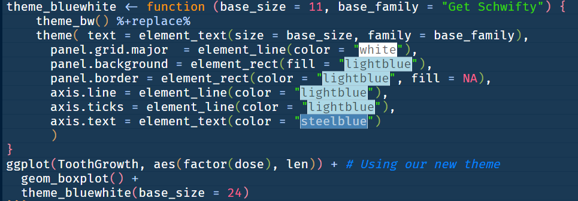

##  {#title-slide background="images/flowers.JPG"}

```{r}
#| label: setup
#| cache: false
#| echo: false
#| include: false


library(tidyverse)
library(gt)
library(showtext)
rotating_text <- function(x, align = "top") {
  glue::glue('
<div style="overflow: hidden; height: 1.2em;">
<ul class="content__container__list {align}" style="text-align: {align}">
<li class="content__item">{x[1]}</li>
<li class="content__item">{x[2]}</li>
<li class="content__item">{x[3]}</li>
<li class="content__item">{x[4]}</li>
</ul>
</div>')
}
fa_list <- function(x, incremental = FALSE) {
  icons <- names(x)
  fragment <- ifelse(incremental, "fragment", "")
  items <- glue::glue('<li class="{fragment}"><span class="fa-li"><i class="{icons}"></i></span> {x}</li>')
  paste('<ul class="fa-ul">', 
        paste(items, collapse = "\n"),
        "</ul>", sep = "\n")
}
```

```{r}
#| label: ggplot-theme
#| cache: false
#| echo: false
#| 
my_font <- "Neucha"
my_font <- "Coming Soon"
font_add(family = my_font, regular = "assets/ComingSoon-Regular.ttf")
showtext_auto()
theme_clean <- function() {
    theme_minimal(base_family = my_font) +
        theme(panel.grid.minor = element_blank(),
              text = element_text(size = 42, family = my_font),
              plot.background = element_rect(fill = "white", color = NA),
              axis.text = element_text(size = 42),
              axis.title = element_text(face = "bold", size = 42),
              strip.text = element_text(face = "bold", size = rel(0.8), hjust = 0),
              strip.background = element_rect(fill = "grey80", color = NA),
              legend.text = element_text(size = 48))
}
theme_set(theme_clean())

```

::: title-box
<h2>`r rmarkdown::metadata$pagetitle`</h2>

👨‍💻 [`r rmarkdown::metadata$author` \@ `r rmarkdown::metadata$institute`]{.author} 👨‍💻

`r rotating_text(c('<i class="fa-solid fa-envelope"></i> eugene.hickey@tudublin.ie', '<i class="fa-brands fa-mastodon"></i> @eugene100hickey', '<i class="fa-brands fa-github"></i> github.com/eugene100hickey', '<i class="fa-solid fa-globe"></i> www.fizzics.ie'))`
:::

------------------------------------------------------------------------

```{r}
#| label: libraries
#| echo: false

library(tidyverse)
library(scales)
library(gapminder)
library(flipbookr)
library(stars)
library(ggalt)
library(patchwork)
library(ggridges)
library(lubridate)
library(boxoffice)
library(marquee)
```

```{r ink-free}
#| cache: false
#| echo: false
sysfonts::font_add("Ink Free", regular = "fonts/Inkfree.ttf")
showtext::showtext_auto()
```


## Graphics Key Feature of R 

- Graphics are important, overlooked, and inconsistent
   - the last mile of data analysis
   
- Need to tell a story

- Can be misleading, almost always by accident

- Choice of colours / fonts

- Keep it simple - reduce amount of ink

- Increasing number of options for showcasing your data


## Kernel of graphics in R is  `ggplot`

- `ggplot` is easy to make publication-ready  

- easier to make sequence of visualisations  

- fits in nicely with the rest of the tidyverse


## Lots of addin packages for ggplot


`r read_csv("data/my-packages.csv")$packages`


## Basic Picture of ggplot


::: callout-tip
## Three Features of a Plot

- aesthetics
    - values that each individual observation (row) has
    - will be different for each observation
- attributes
    - values that are shared between all points
    - decide to make everything mint green
- layers
    - each visualisation is built sequentially
    - add features in layers, one on top of the last
    - examples: add a plot title, change an axis scale....

:::

---


```{r}
#| label: flipbookexample
#| echo: false
#| eval: false

penguins %>% drop_na() %>% 
  ggplot() +
  aes(x = flipper_len) +
  scale_x_continuous(breaks = seq(170, 230, by = 20)) +
  aes(y = bill_len) + 
  geom_point(size = 3, show.legend = F) +
  aes(colour = species) +
  scale_color_manual(values = c("black", "blue", "grey70")) +
  ggalt::geom_encircle(size = 5, show.legend = FALSE) +
  labs(title = "Chinstraps have Short Flippers",
       subtitle = "{.black Adelie}, {.blue Chinstrap}, and {.#B0B0B0 Gentoo} penguins",
       x = "Flipper Length (mm)",
       y = "Bill Length (mm)",
       caption = "@Data from Palmer Penguins") +
  theme(text = element_text(family = "Ink Free", size = 32)) +
  theme(plot.subtitle = element_marquee(width = 1)) + 
  facet_grid(~sex)

```

`r flipbookr:::chunq_reveal("flipbookexample", title = "ggplot Runthrough", lcolw = "40", rcolw = "60", chunk_options = "fig.height = 8, fig.width = 10", smallcode = TRUE)`

```{r theme, cache = F, echo = FALSE}
my_colour = "firebrick4"
ggplot2::theme_set(ggplot2::theme_minimal())
ggplot2::theme_update(text = ggplot2::element_text(family = "Ink Free", 
                                 size = 20, 
                                 colour = my_colour),
             axis.text = ggplot2::element_text(colour = my_colour),
             rect = element_rect(colour = my_colour),
             line = element_line(colour = my_colour))
caption = "@DataVis_2023 Eugene"

my_ordinal_date <- function(dates){
     dayy <- day(dates)
     suff <- case_when(dayy %in% c(11,12,13) ~ "th",
                       dayy %% 10 == 1 ~ 'st',
                       dayy %% 10 == 2 ~ 'nd',
                       dayy %% 10 == 3 ~'rd',
                       TRUE ~ "th")
     paste0(dayy, suff)
}
```


## Graphics can be Fun


---

```{r rollercoaster, echo=FALSE, message=FALSE, warning=FALSE, out.height="600", out.width="800"}
library(tidyverse)
library(imager)
library(grid)
library(showtext)

font_add(family = "Ink Free", regular = here::here("week-05", "assets", "ComingSoon-Regular.ttf"))
showtext_auto()

#data
tx_injuries <- readr::read_csv("https://raw.githubusercontent.com/rfordatascience/tidytuesday/master/data/2019/2019-09-10/tx_injuries.csv")

#Cleaning the age column, the one I'll be using
injuries <- tx_injuries%>%
  mutate(age = as.numeric(age))%>%
  filter(age != "NA")


#creating dataframe with density as I want to plot with geom_line
inj_dens <- density(injuries$age)
df <- data.frame(x=inj_dens$x, y=inj_dens$y)%>%filter(x>= 0)

#Second data frame that will be used to create "fake gridlines"
#I'm basically taking the density df and selecting every 20th row
#this will create the "structure" of the rollercoaster
df2 <- df[seq(1, nrow(df), 20), ]

img1 <- load.image(here::here("week-05", "images", "roller.png"))
g1 <- rasterGrob(img1, interpolate=FALSE)

img2 <- load.image(here::here("week-05", "images", "roller2.png"))
g2 <- rasterGrob(img2, interpolate=FALSE)

img3 <- load.image(here::here("week-05", "images", "roller3.png"))
g3 <- rasterGrob(img3, interpolate=FALSE)

#plotting!
roller <- df %>%
  ggplot(aes(x,y))+
  geom_line(color = "#e44fb7", size = 1.5)+
  scale_x_continuous(breaks = seq(0, 70, by = 10))+
  scale_y_continuous(limits = c(0, 0.03))+
  theme_minimal() +
  theme(
    plot.background = element_rect(fill = "black"),
    panel.grid = element_blank(),
    plot.margin = unit(c(1.2, 0.5, 0.5, 0.5), "cm"),
    #adds some space around
    text = element_text(
      color = "white",
      size = 32,
      family = "Ink Free",
      face = "bold"
    ),
    axis.text = element_text(color = "white"),
    axis.title.y = element_blank(),
    axis.text.y = element_blank(),
    plot.caption = element_text(
      color = "#ec99d3",
      size = 9,
      family = "Arial"
    ),
    plot.title = element_text(
      face = "bold",
      hjust = 0.5,
      color = "white",
      size = 14,
      vjust = 2,
      family = "Ink Free"
    ),
    #vjust to move it towards margins
    panel.spacing = unit(2, "lines")
  ) +
  labs(
    title = "Age distribution of Amusement Park injuries in Texas",
    y = "Density",
    x = "Age of injured person",
    caption = "#tidytuesday by @ariamsita, data: data.world"
  )
 
roller
```
---

```{r rollertext, echo=FALSE, message=FALSE, warning=FALSE, out.height="600", out.width="800"}
roller <- roller + 
  #The two annotations: one curve and one text for each
  geom_curve(x = 13, y = 0.028, xend = 18, yend = 0.029, color = "#ec99d3",
             curvature = -0.2,  arrow = arrow(length = unit(0.1, "inches"))) +
  annotate(
    "text",
    x = 28.5,
    y = 0.029,
    label = "There is a peak in injuries among children aged around 10",
    color = "white",
    size = 5
  ) +
  geom_curve(
    x = 32,
    y = 0.017,
    xend = 43,
    yend = 0.019,
    color = "#ec99d3",
    curvature = -0.2,
    arrow = arrow(length = unit(0.1, "inches"))
  ) +
  annotate(
    "text",
    x = 56,
    y = 0.019,
    label = "From age 35 onwards, injuries sharply decrease (probably attendance to amusement parks too!)",
    color = "white",
    size = 5
  )
roller  
  
```

---

```{r rollerwagons, echo=FALSE, message=FALSE, warning=FALSE, out.height="600", out.width="800"}
roller +
    #Now adding the wagons:
  annotation_custom(g1, xmin=4.5, xmax=14, ymin=0.025, ymax=0.031) +
  annotation_custom(g2, xmin=31, xmax=39, ymin=0.013, ymax=0.020) +
  annotation_custom(g3, xmin=74, xmax=84, ymin=-0.0015, ymax=0.005)  + 
  geom_linerange(data = df2, aes(x =x, ymin = 0, ymax = y),
                 color = 'grey80', alpha = 0.8, linewidth=1.5) + #the gridlines+
  geom_line(color = "#e44fb7", size = 1.5) #x is age, y is density

```


## Picturing Data Different Ways with ggplot

### We're going to set out some of the options for looking at data

### these depend on what kind of data you have

### and what you want to investigate

Lots of these come from [Top 50 Visualizations in R](http://r-statistics.co/Top50-Ggplot2-Visualizations-MasterList-R-Code.html#5.%20Composition)

- Show the data

- Use ink sparingly

- Title should tell the story

- Don't try to show too much

- Start with grey

## Visualising Amounts

- <span style="color: red;"> Visualising Proportions </span>

- <span style="color: red;"> Visualising Distributions </span>

- <span style="color: red;"> Visualising Relationships </span>

- <span style="color: blue;"> Visualising Time Series </span>

- <span style="color: blue;"> Visualising Groups </span>

- <span style="color: blue;"> Visualising Networks </span>

- <span style="color: blue;"> Visualising Spatial Data </span>

Items in <span style="color: red;">red</span> we'll cover this today. In <span style="color: blue;">blue</span> will have to wait for a future workshop.


## Visualising Amounts

- barplot
 
- dot plot

- lollipop plot

---


```{r}
#| label: barplot2
#| echo: false
#| eval: false
diamonds %>% 
  ggplot(aes(cut)) + 
  geom_bar(fill = "dodgerblue1") + 
  ggtitle("Proportion of Cuts of Diamonds") + 
  labs(caption = "@Data tidyverse") +
  coord_flip() +
  theme_clean() +
  theme(text = element_text(size = 40)) + 
  theme(axis.text.x = element_blank()) + 
  theme(axis.title = element_blank()) + 
  theme(title = element_text(face = "bold"))
```

`r flipbookr:::chunq_reveal("barplot2", title = "Bar Plots", lcolw = "40", rcolw = "60", chunk_options = "fig.height = 8, fig.width = 10", smallcode = TRUE)`

---


```{r data, cache = F, echo=T, message=FALSE, warning=FALSE}
boxoffice_date <- Sys.Date()-7
movies <- boxoffice(boxoffice_date) |>  
  mutate(gross = gross / 1e6,
         movie_name = movie,
         movie = abbreviate(movie))
sf <- stamp("Sunday, 8th January, 1999")
boxoffice_date_string <- sf(boxoffice_date)
```

---


```{r}
#| label: box-office
#| echo: false
#| eval: false

movies %>% mutate(movie = fct_reorder(movie, gross)) %>% 
  slice_head(n=10) %>% 
  ggplot(aes(movie, gross)) + 
  geom_col(fill = "firebrick4") + 
  theme_clean() + 
  scale_y_continuous(breaks = scales::breaks_extended(8), 
                     labels = scales::label_dollar(scale = 1)) + 
  labs(title = glue::glue("Box Office {boxoffice_date_string}"),
       caption = "@Data from BoxOfficeMojo",
       y = "Gross (Million$)") +
  coord_flip() +
  theme(axis.title.y = element_blank())
```

`r flipbookr:::chunq_reveal("box-office", title = "Movie Barplot", lcolw = "40", rcolw = "60", chunk_options = "fig.height = 8, fig.width = 10", smallcode = TRUE)`

---

```{r echo=FALSE}
library(gt)
movies |> 
  select(movie_name, movie) |> 
  head(10) |> 
  gt::gt() |> 
  cols_label(movie_name = md("Movie Title"),
             movie = md("Abbreviated Title"))
```


```{r}
#| label: colplot-penguins
#| echo: false
#| eval: false

penguins %>% 
  group_by(species) %>% 
  summarise(body_mass = mean(body_mass, na.rm = T)) %>%
  ggplot(aes(species, body_mass, xend = species, yend = body_mass)) + 
  theme_clean() +
  coord_flip() +
  labs(caption = "@PalmerPenguins",
       y = "Body Mass (g)", 
       x = "") +
  ylim(c(0, 6000)) +
  geom_col(fill = "firebrick4") + #ROTATE
  geom_point(colour = "firebrick4", size = 4) + #ROTATE
  geom_segment(linewidth = 2, colour = "firebrick4", y = 0) + geom_point(colour = "firebrick4", size = 4) + #ROTATE
  labs(x = "")
  
```


`r flipbookr:::chunq_reveal("colplot-penguins", title = "Column Plot", lcolw = "40", rcolw = "60", chunk_options = "fig.height = 8, fig.width = 10", smallcode = TRUE, break_type = "rotate")`


## Visualising Distributions

- histograms

- density plots

- boxplot

- violin plot

- ridge plots

##


```{r basketball, cache = T, echo = T, message=F, warning=F}
basketball <- read_csv("https://raw.githubusercontent.com/eugene100hickey/ATU-2023/main/week-05/data/basketball.csv")
```


```{r histogram1, echo = T, include=F}
basketball %>% 
  ggplot(aes(weight)) + 
  geom_histogram(fill = "firebrick4", 
                 bins = 50) + 
  labs(x = "weight (kg)", 
       y = "",
       caption = "@Data from Kaggle",
       title = "Weight of NBA Players")
```


`r flipbookr:::chunq_reveal("histogram1", title = "Histogram", lcolw = "40", rcolw = "60", chunk_options = "fig.height = 8, fig.width = 10", smallcode = TRUE)`

---

```{r histogram-dodge, echo = T, fig.height=6, include = FALSE}
basketball %>% 
  ggplot(aes(weight, 
             fill = position)) + 
  geom_histogram(bins = 20, 
                 position = "dodge") + 
  labs(x = "weight (kg)", 
       y = "",
       caption = "@Data from Kaggle", 
       title = "Weight of NBA Players by\nPosition")
```


`r flipbookr:::chunq_reveal("histogram-dodge", title = "Histogram", lcolw = "40", rcolw = "60", chunk_options = "fig.height = 8, fig.width = 10", smallcode = TRUE)`

---

```{r density1, echo = T, fig.height=6, include = FALSE}
basketball %>% 
  ggplot(aes(weight, 
             col = position)) + 
  stat_density(geom = "line", 
               position = "identity") + 
  labs(x = "weight (kg)", 
       y = "",
       caption = "@Data from Kaggle", 
       title = "Weight of NBA Players by\nPosition") +
  geom_rug()
```


`r flipbookr:::chunq_reveal("density1", title = "Density Plot", lcolw = "40", rcolw = "60", chunk_options = "fig.height = 8, fig.width = 10", smallcode = TRUE)`

---


```{r boxplots, echo = T, fig.height=6, include = FALSE}
basketball %>% 
   ggplot(aes(x = position, 
              y = weight, 
              colour = position)) +
   geom_boxplot(show.legend = F) + 
   labs(y = "weight (kg)", 
        x = "position",
        caption = "@Data from Kaggle", 
        title = "Weight of NBA Players by\nPosition") +
  geom_jitter(size = 0.4, 
              alpha = 0.2, 
              show.legend = F)
```


`r flipbookr:::chunq_reveal("boxplots", title = "Boxplot", lcolw = "40", rcolw = "60", chunk_options = "fig.height = 8, fig.width = 10", smallcode = TRUE)`

```{r violins, echo = T, fig.height=6, include = FALSE}
basketball %>% 
   ggplot(aes(x = position, 
              y = weight, 
              colour = position)) + 
   geom_violin(show.legend = F) + 
   labs(x = "position",
        y = "weight (kg)",
        caption = "@Data from Kaggle", 
        title = "Weight of NBA Players by\nPosition") +
   geom_jitter(size = 0.4, 
               alpha = 0.2, 
               show.legend = F)
```


`r flipbookr:::chunq_reveal("violins", title = "Violin Plot", lcolw = "40", rcolw = "60", chunk_options = "fig.height = 8, fig.width = 10", smallcode = TRUE)`

---

```{r ridges, echo = T, fig.height=6, include = FALSE, message=FALSE, warning=FALSE}
gapminder::gapminder %>% 
  ggplot(aes(x = lifeExp, 
             y = factor(year))) +
  geom_density_ridges(fill = "firebrick4", 
                      colour = "firebrick4", 
                      alpha = 0.4) +
  theme_ridges() +
  labs(x = "Life Expectancy (years)",
       y = "", 
       caption = "@Data Gapminder (WHO)")
```


`r flipbookr:::chunq_reveal("ridges", title = "Ridge Plot", lcolw = "40", rcolw = "60", chunk_options = "fig.height = 8, fig.width = 10", smallcode = TRUE)`


## Summary of Distributions

- hugely important

- great way to explore your data / introduce it to others

- make sure you show you data when possible

    - use *geom_rug()*
    - use *geom_jitter()*
    - if lots of points, then use *alpha* to mute them
    


## Visualising Relationships

- scatter plots

    - encircling
    - jittering
    - using colour / size / shape 
    - fitting lines
    - histograms and boxplots on the axes (and geom_rug())
    
- line plots

- correlation


---

```{r encircleplot, echo = T, fig.height=4, include = FALSE}

dslabs::stars %>% 
  ggplot(aes(temp, 
             magnitude, 
             col = type)) + 
  geom_point(show.legend = F) +
  geom_encircle(data = dslabs::stars %>% 
                  dplyr::filter(type == "B" | (type == "M" & magnitude > 9)), 
                show.legend = F) +
  scale_x_log10() + 
  annotate("text", 
           x = c(15000, 5000), 
           y = c(-4, 14), 
           label = c("Type B Stars", "Faint Type M Stars"), 
           col = c("blue", "olivedrab3"), 
           family = "Ink Free", 
           size = 4, 
           fontface = 2) + 
  scale_color_viridis_d()
```


`r flipbookr:::chunq_reveal("encircleplot", title = "Encircle", lcolw = "40", rcolw = "60", chunk_options = "fig.height = 8, fig.width = 10", smallcode = TRUE)`

---

```{r jitter, echo = T, fig.height=5, fig.width=12}
scatter <- HistData::Galton %>% 
  ggplot(aes(parent, child)) +
  geom_point()
jittered <- HistData::Galton %>% 
  ggplot(aes(parent, child)) + geom_jitter(width = 0.4, height = 0.4)
scatter + plot_spacer() + jittered 
```


## Choice of Colours in R

- colours are very important

    - second only to position for perception
    
- can carry information

- also important to be visually pleasing

- worthwhile to make your figures aesthetically attractive

    - visualisations that are engaging are more effective


## Types of Colour Scales

- qualitative

    - suite of colours that are easily distinguished
    - no heirarchy
    - caters for visual impairments

```{r qualitative_palette, echo = F, message = F, warning=F, fig.height=4}
library(tidyverse)
library(RColorBrewer)
library(dslabs)
library(MASS)
display.brewer.pal(8, name = "Accent")
```

---


- sequential

    - band of colours that are increasingly intense
    - go from low to high
    
    
```{r sequential_palette, echo = F, message = F, warning=F, fig.height=4}
display.brewer.pal(8, name = "BuGn")
```

---

- diverging

    - suite of colours that go from minus to plus
    - contrasting colours at each end
    - something bland and neutral in the middle

    
```{r diverging_palette, echo = F, message = F, warning=F, fig.height=4}
display.brewer.pal(8, name = "PRGn")
```
---

## Getting Colours in R

- some really great packages

    - `RColorBrewer()`
    
        - excellent package giving fine control over palette choice
        
    - `viridis()`
    
        - excels at palettes for vision-impaired readers
        
    - `paletteer()`
    
        - collection of palettes from various sources
        
    - `wesanderson`
    
        - *names(wes_palettes)* followed by *wes_palette("BottleRocket1")*

---

- more....

    - `tvthemes()`
    
        - not just colours, but layouts and fonts
        - everything from Game of Thrones to Spongebob (yes, really)
        
    - `ggsci()`, palettes for scientific publications (Lancet, AAAS, etc)
    
    - `colorspace()`
    
        - resources for picking colours
        - choose_color() and choose_palette()
        - can convert colours based on vision deficiencies
        - will convert from colour descriptions, e.g. hex2RGB()
        
- and a [cheatsheet](https://www.nceas.ucsb.edu/~frazier/RSpatialGuides/colorPaletteCheatsheet.pdf){target="_blank"}

---

## Ways of Describing Colours

- by name: "red", "cyan", "violetred4", "thistle".....

    - get full list of 657 available in R from _colors()_
    
    
- by hex code: "#f49340", "#40f9f9", "#ee82ef", "#d8bfd1"....

- by rgb values: (249, 67, 64), (64, 249, 249), (57, 14, 30), (216, 191, 209)....

- by hcl values: (53.24, 179.04, 12.17), (91.11, 72.10, 192.17), (32.36, 63.11, 349.86), (80.08, 20.79, 307.73)....


## Investigating Colours in R

- the following code shows the first "N" colours in R where N is set to 20 here:

```{r base_colours, message = F, warning = F, fig.height=3}
N <- 20
data.frame(col = colors()[1:N]) %>% 
  ggplot(aes(x = col, fill = col)) + 
  geom_bar(position = "stack", show.legend = F) + 
  coord_flip() + 
  theme_minimal() + 
  theme(axis.text.x = element_blank(), axis.title.x = element_blank(), axis.text.y = element_blank())
```


## Other Usful Functions

- _show_col()_ from the _scales_ package is super useful

    - e.g. show_col("red") or show_col("#84a412")
    
- *rgb()* will give a hex code for a fraction of red, green, blue

    - e.g. rgb(0.4, 0.2, 0.5) gives "#663380"
    
- *colourPicker()* from the colourpicker package

    - colourPicker(numCols = 4), opens up shiny app, returns colours
    
    
- *col2rgb()*, also *col2hex()* from the _gplots_ package, and *col2hcl* from the _jmw86069/jamba_ package

    - this last is on github, so you must install the package _devtools_ then do _install_github( jmw86069/jamba)_


## Some Websites and Tools

- [coolors.co](https://coolors.co/){target="_blank"}

    - will generate appropriate palettes
    
- [colorpicker](http://tristen.ca/hcl-picker/#/hlc/6/1.1/8C4443/845128){target="_blank"}

- [colorspace](http://colorspace.r-forge.r-project.org/articles/hcl_palettes.html#qualitative-palettes){target="_blank"}

- Chrome has an _**Eye Dropper**_ tool

    - click on part of a webpage and it will tell you the colour
    
- Nice description of colurs from [Stowers](https://www.uv.es/conesa/CursoR/material/UsingColorInR.pdf){target="_blank"}
    
---

## Colours in _ggplot()_

- use for _fill_ and for _col_ aesthetics

- add the _scale_fill_... and _scale_color_... layers to control

- explore these by typing _?scale_fill_ and then TAB to see the range of options


## Using Themes in R

- We'll also discuss fonts (first).

- themes give fine control to the appearance of your plots

    - control over text size, fonts, text colour, etc
    - position of legends, titles, captions, etc
    - colours of backgrounds
    - delete unwanted features (like, say, tick marks on an axis)

##
    
- large number of preset themes

- several packages with neat bundle of useful themes

- and, of course, we can develop our own theme to have consistent graphics


## Fonts

- we'll discuss this first, as often themes require fonts which might not be present

- fonts are a whole world of their own

- see [practicaltypography.com](https://practicaltypography.com/){target="_blank"}

##

- need to be in the system, load them into windows / mac / linux

    - only really works for true type fonts (.ttf)
    - go to folder where the R library lives and seek out fonts
    - e.g. R/x86_64-pc/3.6/tvthemes/fonts/SpongeBob
    - click on .ttf files to install
    
- then need to capture them  in R


    - install package *extrafont*
    - run *ttf_import()* with path = folder from above
    - run *fonts()* to check available fonts
    - usually need to restart R (*Session* then *Restart R*)
    
##

- `showtext` package also useful

   -  `font_add(family = "Get Schwifty", regular = "fonts/get_schwifty.ttf")`
   -  `showtext_auto()`
    
- can also use [google fonts](https://fonts.google.com/){target="_blank"} (`showtext::font_add_google("my_special_font")`)


## Complete Themes

- these set up ggplots with standard appearances

- can always adjust these, but do so in a layer after invoking the theme

- some defaults in ggplot2, see [here](https://ggplot2.tidyverse.org/reference/ggtheme.html){target="_blank"}

- you should experiment with these to see how they look

```{r setup1, echo = F, message=F, warning=F}
library(tidyverse)
library(scales)
library(gapminder)
```

##

:::: {.columns}

::: {.column width="50%"}

```{r themes1}
penguins %>% ggplot(aes(bill_len, bill_dep, col = species)) + 
  geom_point() +
  theme_classic()
```

:::

::: {.column width="50%"}

```{r themes2}
penguins %>% ggplot(aes(bill_len, bill_dep, col = species)) + 
  geom_point() +
  theme_dark()
```

:::
::::

## Complete Themes

::: {style="font-size: 80%;"}

- other package provide supplementary themes

    - *ggthemes*
    - *ggthemr* (see [here](https://github.com/cttobin/ggthemr){target="_blank"})
    - *tvthemes* (see [here](https://ryo-n7.github.io/2019-05-16-introducing-tvthemes-package/){target="_blank"})
    - *hrbrthemes* see [here](https://github.com/hrbrmstr/hrbrthemes){target="_blank"}
    - *firatheme* (see [here](https://github.com/vankesteren/firatheme){target="_blank"})
    - *bbplot*, themes from the BBC (see [here](https://github.com/bbc/bbplot){target="_blank"})
    - *ggtech* themes from companies, e.g. Facebook. See [here](https://github.com/ricardo-bion/ggtech){target="_blank"}
    
- [This website](https://rfortherestofus.com/2019/08/themes-to-improve-your-ggplot-figures/){target="_blank"} is pretty good on themes
- again, make sure you experiment with these

:::


## Fine Control Over Themes

- we can change any feature of a theme that we want
- type *?theme* on the console to see available themes
- use *element_&&&&&* to replace theme
- example: *theme(text = element_text(family = "Roboto Sans"))*

##

```{r themes3, fig.height=6}
penguins %>% ggplot(aes(bill_len, bill_dep, col = species)) + 
  geom_point() +
  theme(text = element_text(family = "Ink Free", size = 40, face = "bold"))
```

##

```{r themes4, fig.height=6}
penguins %>% ggplot(aes(bill_len, bill_dep, col = species)) + 
  geom_point() +
  theme(legend.position = "bottom", axis.text.y = element_blank())
```


##





##


```{r fig.height=4, echo=FALSE}
font_add(family = "Get Schwifty", regular = "fonts/get_schwifty.ttf")
showtext_auto()
theme_bluewhite <- function (base_size = 11, base_family = "Get Schwifty") {
    theme_bw() %+replace% 
    theme( text = element_text(size = base_size, family = base_family),
      panel.grid.major  = element_line(color = "white"),
      panel.background = element_rect(fill = "lightblue"),
      panel.border = element_rect(color = "lightblue", fill = NA),
      axis.line = element_line(color = "lightblue"),
      axis.ticks = element_line(color = "lightblue"),
      axis.text = element_text(color = "steelblue")
      )
}
ggplot(ToothGrowth, aes(factor(dose), len)) + # Using our new theme
  geom_boxplot() +
  theme_bluewhite(base_size = 24)
```


## Workshop Week 5:

- you have a dataset with the counties of Ireland in one column and their populations in a second column. To produce a bar chart, should you use *geom_col()* or *geom_bar()*?

- make a bar chart of the number of counties in each of the five US midwest states. Use the *midwest* dataset from *ggplot2*

-  make a bar chart of the number of each species of pengiun from the *penguins* dataset

- make a bar chart of the 12 *Carnivora* total sleep times from the *msleep* dataset in *ggplot2*

##

- make a lollipop plot of the 12 *Primates* total sleep times from the *msleep* dataset in *ggplot2*

- install the *boxoffice* package from github (`devtools::install_github("jacobkap/boxoffice"`). Use the following commands to downloads box office receipts from this day last week:

```
boxoffice_date <- Sys.Date()-7
movies <- boxoffice(boxoffice_date) %>% 
     mutate(gross = gross / 1e3,
            movie_name = movie,
            movie = abbreviate(movie)) %>% 
     head()
```
Plot a pie chart of gross receipt for these top six films (see the [R Graph Gallery](https://r-graph-gallery.com/piechart-ggplot2.html){target="_blank"})


## Assignment - Week Five

You are tasked with reproducing the following figure:

```{r plot, echo = F, message = F, warning=F, fig.height=6}
library(tidyverse)
library(dslabs)

death_prob %>% 
  ggplot(aes(age, prob, col = sex)) + 
  geom_point() + 
  scale_y_log10() + 
  labs(title = "Probability of Death within 1 Year by Age and Sex\nin the United States in 2015", x = "Age in Years", y = "Probability of Death", caption = "@Data from DSLabs")
```


## Procedure

::: {style="font-size: 90%;"}

- You'll need the _tidyverse_ library and the _dslabs_ library (install from CRAN by _install.packages("dslabs")_)

- Get the dataset using _data("death_prob")_

- You'll need to call ggplot setting _data = death_prob_

- There are three aesthetics; for _age_, _prob_, and _sex_

- Add the graph title, the axes labels, and add a caption

- The y axis should be plotted on a log scale

- There are also extra marks for improving the figure with your own ideas

- You can save your plot using _ggsave("my-first-assignment.png")_ at the console or in your .R file, or by clicking _Export_ in the plots pane of RStudio

:::

## Marking

- Correct call to _ggplot_ to set up the figure framework **(2 marks)**

- Correct _geom_ to insert the points  **(2 marks)**

- Inserting the _title_, _axes labels_, and _caption_  **(2 marks)**

- Making the y-axis on a log scale using _scale_y_log10_  **(2 marks)**

- Your improvement  **(2 marks)**

Upload your work (the image and your code) to moodle at [Week Five Assignment - death_prob](https://vlesligo.atu.ie/mod/assign/view.php?id=1092783){target="_blank"}. The deadline is midnight on Saturday 17th May 2025.


